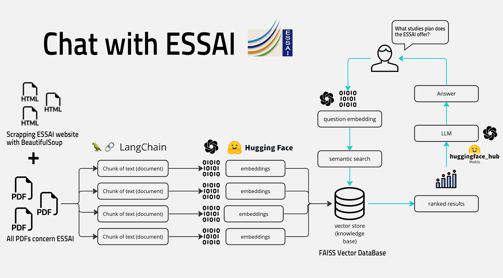

# Chatbot-Assistant
Project aimed at developing a chatbot assistant for our college to help new students by answering questions about rules, lectures, and administrative processes. Tech: RAG, FAISS, LangChain, Huggingface, Transformers, Streamlit
#image

